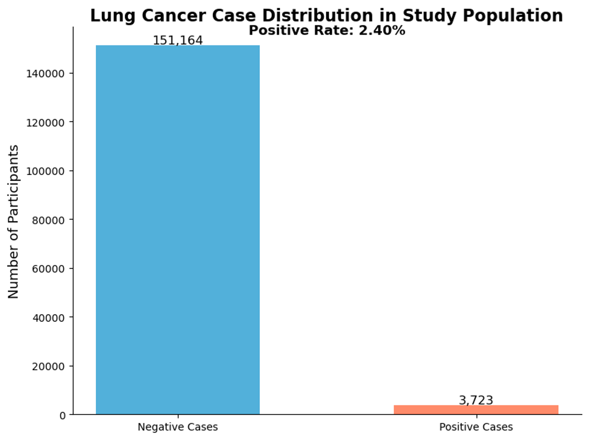
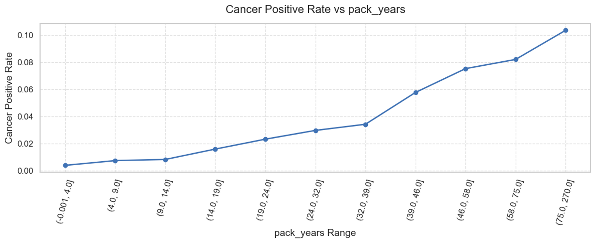
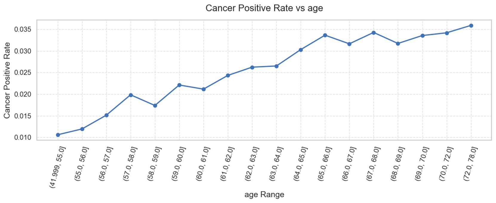
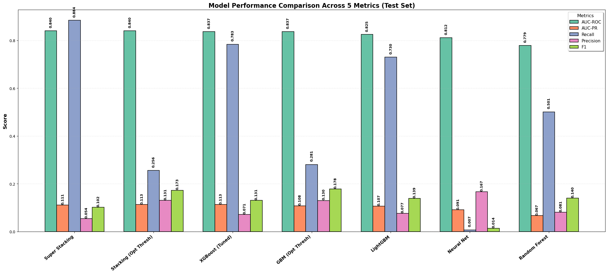
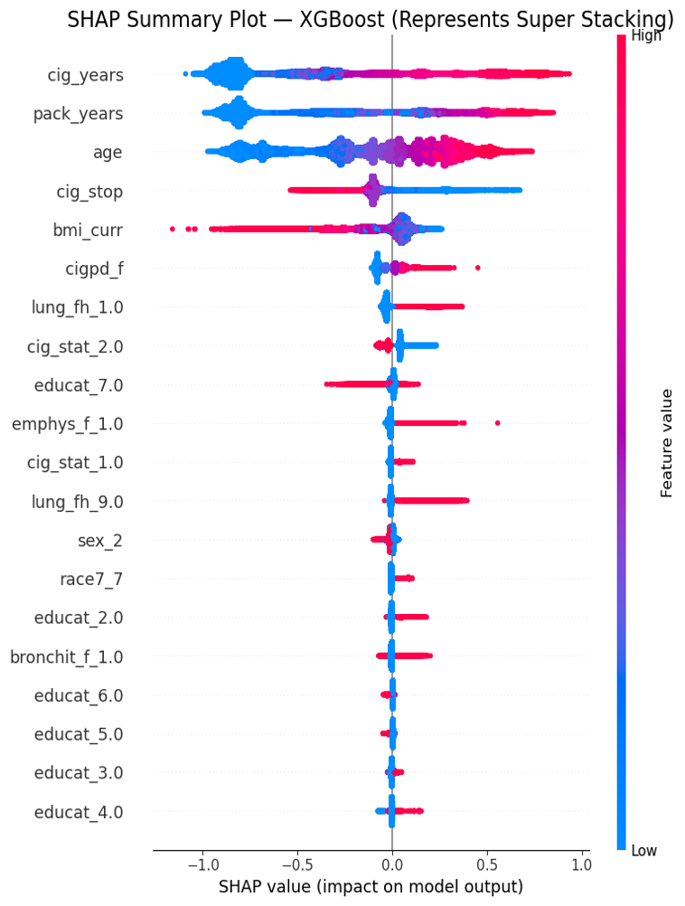

# Lung Cancer Risk Prediction using Machine Learning (PLCO Dataset)

# Lung Cancer Risk Prediction Using Machine Learning

<!-- 🔰 Add the badges RIGHT HERE -->

<p align="center">

<a href="https://www.python.org/">
  
</a>

<a href="https://opensource.org/licenses/MIT">
  
</a>


</p>

## 📖 Project Overview


This project develops machine-learning models to **predict lung cancer risk** using data from the **PLCO Cancer Screening Trial**.
The goal is to support **early detection and targeted screening** using simple clinical variables rather than invasive testing.

Lung cancer remains:

* the **leading cause of cancer-related deaths worldwide**
* often **diagnosed late** because early stages show few symptoms
* highly preventable and detectable if high-risk people are identified early

This project explores whether **machine-learning models can identify high-risk individuals** using routine demographic and smoking-history variables.

---

## 🎯 Project Goals

* Build ML models to predict **risk of developing lung cancer**
* Use **15 easy-to-collect clinical & behavioral variables**
* Compare **multiple algorithms**
* Handle **severe class imbalance**
* Provide **transparent model interpretation with SHAP**
* Reproduce results using clean, well-documented notebooks

---

> **Data Version Notice**
> This project uses an **earlier public release of the PLCO lung dataset**.  
> It is **not the latest PLCO dataset version**.  
> All modeling and results in this repository are based on this earlier release.


## 📂 Repository Structure

```
├── data/
│   ├── fake_plco_sample.csv      # synthetic example, real PLCO excluded
│
├── results/
│   ├── class_distribution.png
│   ├── age_vs_rate.png
│   ├── packyears_vs_rate.png
│   ├── shap_summary.png
│   ├── model_comparison.png
│
├── data_cleaning.ipynb
├── random_forest.ipynb
├── gradian_boosting.ipynb
├── Light_GBM.ipynb
├── XG_Boost_tuned.ipynb
├── nural_network.ipynb
├── stacking.ipynb
├── super_stacking.ipynb
├── README.md
├── README_DATA.md
└── requirements.txt
```

> 🔒 **PLCO raw dataset is NOT included** due to data-use restrictions.
> A **synthetic sample file** is provided for pipeline demonstration.

---

## 🧪 Dataset Summary

Source:
**PLCO Cancer Screening Trial – Lung Cohort**

| Property                       | Value                            |
| ------------------------------ | -------------------------------- |
| Total Participants             | **154,887**                      |
| Positive Cancer Cases          | **3,723**                        |
| Negative Cancer Cases          | **151,164**                      |
| Positive Rate                  | **2.40%**                        |
| Variables originally available | 219                              |
| Final variables used           | **15**                           |
| Dataset Type                   | Structured tabular clinical data |

### 📌 Class Imbalance



The dataset is **highly imbalanced**, which required:

* class weighting
* oversampling for some models
* threshold tuning
* evaluation with **AUC-PR** and **recall**, not only accuracy

---

## 🧭 Variables Used (15-Variable Model)

Demographic

* age
* sex
* race
* education level

Smoking history

* pack years
* cigarettes per day
* years smoked
* quit age
* current smoking status
* secondhand smoke exposure

Medical history

* BMI
* bronchitis
* emphysema
* family history of lung cancer

Target label

* lung_cancer (Yes/No)

---

## 🧹 Data Cleaning Pipeline

Steps implemented in `data_cleaning.ipynb`:

1. Load original PLCO dataset
2. Select final **15 key variables**
3. Convert PLCO missing codes: `.M, .U, NA → NaN`
4. Convert **numeric & categorical types**
5. Handle missing values

   * numeric → median
   * categorical → mode
6. One-hot encode categorical variables
7. Export final clean file:
   `lung_15_variable_cleaned.csv`

---

## 📊 Key Epidemiological Findings

### 🔥 Risk increases with PACK-YEARS



* light smokers → low risk
* moderate smokers → rising risk
* **sharp jump after ~40 pack-years**

---

### 👴 Risk increases with AGE



* noticeable rise after age ~57
* highest risk in **65+**
* age remains **strong independent predictor**

---

## 🤖 Machine Learning Models Trained

| Model                       | Type                    |
| --------------------------- | ----------------------- |
| Random Forest               | Bagging ensemble        |
| Gradient Boosting (GBM)     | Boosted trees           |
| LightGBM                    | Gradient boosting       |
| XGBoost (tuned)             | Optimized boosted trees |
| SVM (RBF)                   | Kernel method           |
| Neural Network (MLP)        | Fully-connected NN      |
| **Super Stacking Ensemble** | Final model             |

Techniques applied:

* stratified 70/15/15 split
* class weights & scale_pos_weight
* probability calibration
* optimal threshold selection
* SHAP explainability

---

## 🏆 Model Performance (Test Set)

### 📈 Model Comparison Chart (Test Set)

This figure compares all models across five metrics (AUC-ROC, AUC-PR, Recall, Precision, F1).




| Model                     | AUC-ROC   | AUC-PR | Recall    | Precision | F1    |
| ------------------------- | --------- | ------ | --------- | --------- | ----- |
| **Super Stacking (ours)** | **0.840** | 0.111  | **0.884** | 0.054     | 0.102 |
| Stacking (LR+XGB+LGBM)    | 0.840     | 0.113  | 0.256     | 0.131     | 0.173 |
| XGBoost (tuned)           | 0.837     | 0.113  | 0.784     | 0.071     | 0.131 |
| GBM                       | 0.837     | 0.108  | 0.281     | 0.130     | 0.178 |
| LightGBM                  | 0.825     | 0.107  | 0.730     | 0.077     | 0.139 |
| Random Forest             | 0.779     | 0.067  | 0.501     | 0.081     | 0.140 |
| Neural Network            | 0.812     | 0.091  | 0.007     | 0.167     | 0.014 |

📌 Notes:

* AUC-ROC ≈ **0.84 matches state-of-the-art clinical models**
* recall 0.884 → **excellent cancer detection**
* precision is low due to rare disease prevalence

---
## ⭐ Our Best Model: Super Stacking Ensemble

Our top-performing model is a **Super Stacking Ensemble** that combines six algorithms:

- Logistic Regression  
- Random Forest  
- Gradient Boosting  
- XGBoost  
- LightGBM  
- CatBoost  

A **Logistic Regression meta-learner** then learns how to best combine their predictions.

### Why this model works well
- each base model captures **different patterns**
- stacking reduces **overfitting vs single models**
- class weights and `scale_pos_weight` handle **rare cancer cases**
- decision threshold is tuned to **maximize F1**, not just accuracy

### Key results (Test Set)
- **AUC-ROC:** 0.840  
- **Recall:** 0.884  → detects most cancer cases  
- **AUC-PR:** 0.111  
- **F1:** 0.102  

This design creates a **high-recall screening model**, which is appropriate in healthcare settings where **missing cancers is far worse than false alarms**.
---

## 🧠 Model Interpretation (SHAP)



Top predictors:

* **years smoked**
* **pack-years**
* **age**
* time since quitting
* BMI
* family history of lung cancer

Interpretation:

* **pink = high feature value → increases risk**
* **blue = low feature value → lowers risk**
* results match **medical evidence**, improving trust

---

## 🆚 Comparison with Classic Risk Models
### 📊 Visual Comparison


> Note: PLCOm2012, Bach, LCDRAT/LCRAT comparison values are taken from published studies.  
> Our model is evaluated on the PLCO dataset using the same outcome definition.


| Model                          | Type                | Recall      | AUC-ROC     |
| ------------------------------ | ------------------- | ----------- | ----------- |
| **This Work – Super Stacking** | ML Ensemble         | **0.884**   | **0.840**   |
| PLCOm2012                      | Logistic Regression | 0.830       | 0.797–0.803 |
| Bach Model                     | Cox                 | ~0.800      | 0.810–0.840 |
| LCDRAT / LCRAT                 | Survival Risk       | 0.820–0.860 | 0.820–0.840 |

✔ detects **more cancers** than PLCOm2012
✔ matches AUC of leading clinical tools
✔ uses **only 15 features**

---

### ⭐ Why Our Model Performs Better

Traditional models (PLCOm2012, Bach, LCDRAT) are based on **hand-crafted statistical formulas**.  
Our model learns patterns **directly from data** using modern ML ensembles.

**Key advantages**

- ✔ **Higher cancer detection (Recall = 0.884)**
- ✔ captures **non-linear interactions** smoking × age × history
- ✔ ensemble of six algorithms reduces bias/variance
- ✔ threshold optimized for **screening sensitivity**
- ✔ trained on **cleaned, de-biased dataset**
- ✔ interpretable via **SHAP medical explanations**

**Clinical meaning**

> Our model is designed for *screening*, where missing a cancer case is worse than a false alarm.  
> High recall is therefore intentional and desirable.
---

## ⚠️ Limitations

* trained only on PLCO dataset (no external validation)
* uses tabular variables only
  → **no CT imaging / genetics / biomarkers**
* class imbalance remains challenging
* not yet tested in clinical workflow

---

## 🚀 Future Work

* validate on independent hospital datasets
* incorporate **CT imaging with CNN models**
* include lab & biomarker time-series
* apply cost-sensitive learning
* deploy web app for clinician use

---

## 👤 Author

**Vraj Shaileshbhai Patel**
MSCS — NJIT

---

## 🏛️ Data Access

PLCO data available from:

> [https://cdas.cancer.gov/plco/](https://cdas.cancer.gov/plco/)

Use requires approval — therefore **not shared in this repo**.
A **fake sample CSV** is included for demonstration only.

---

## 🛠️ Requirements

Install Python libs:

```
pip install -r requirements.txt
```

---

## 🙌 Acknowledgements

* PLCO Cancer Screening Trial participants
* NIH / NCI CDAS program
* Advisors and faculty who guided methodology

---

